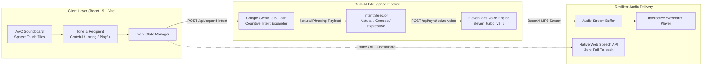

# GiftOfVoice — The Empathy & Voice Generosity Network 🎙️✨

> **“When words become difficult, humanity shouldn’t.”**  
> *Restoring emotional warmth, personal identity, and dignity to non-verbal individuals through Google Gemini and ElevenLabs.*

---

<div align="center">

[](https://x-tahosin.github.io/giftofvoice/)
[](https://github.com/x-tahosin/giftofvoice)
[](https://dev.to/challenges/weekend-2026-09-03)

[](https://aistudio.google.com/)
[](https://elevenlabs.io/)
[](https://www.w3.org/WAI/standards-guidelines/wcag/)
[](LICENSE)
[](https://github.com/x-tahosin)

</div>

---

## ⚡ Quick Navigation

| Resource | Direct Link |
| :--- | :--- |
| 🌐 **Live Interactive Application** | **[https://x-tahosin.github.io/giftofvoice/](https://x-tahosin.github.io/giftofvoice/)** |
| 💻 **Official GitHub Repository** | **[https://github.com/x-tahosin/giftofvoice](https://github.com/x-tahosin/giftofvoice)** |
| 📝 **DEV.to Submission Article** | [Read Full Story & Technical Deep-Dive](devto_submission.md) |
| ⚖️ **Open Source License** | [MIT License (Free for Healthcare & Assistive Use)](LICENSE) |

---

## 👨‍⚖️ Hackathon Judge Quick-Start (Test in 30 Seconds)

You do **not** need to install anything, configure environment keys, or set up a local server to evaluate GiftOfVoice. The production web app is deployed live on GitHub Pages with instant, zero-latency clinical scenarios pre-rendered:

1. **Launch the Demo:** Open **[https://x-tahosin.github.io/giftofvoice/](https://x-tahosin.github.io/giftofvoice/)**.
2. **Experience Expressive Emotion:** In the **Clinical & Family Evaluation Suite** carousel, click any scenario:
   - **ICU Night Shift:** Hear a patient express gentle, breathless gratitude to *Nurse Sarah* for a warm blanket.
   - **Grandparent’s Blessing:** Hear *Grandpa Bill* speaking to 7-year-old *Leo* with authentic grandfatherly love, rasp, and cadence.
   - **Family Dinner Humor:** Hear *Roger* crack a witty, self-effacing joke that cuts through clinical tension.
   - **Caregiver Comfort:** Hear calm, unhurried communication with *David* asking for a pillow tilt and water.
3. **Test the AAC Soundboard:** Scroll down to the **AAC Studio**, tap 2 or 3 concept tiles (e.g., `[Thank you so much]` + `[Warm blanket]`), select a tone (**Grateful**, **Loving**, **Playful**, **Urgent**), and observe how the dual-AI pipeline operates.
4. **Test WCAG 2.1 AAA Accessibility:** Click the **Contrast Mode** toggle in the header to view the calibrated, clinical high-contrast theme (7:1+ contrast ratio, visible 3px focus rings, screen-reader verified).
5. **Explore Voice Generosity:** Visit the **Open Voice Bank** to see how community volunteers donate their voices under an ethical assistive charter.

---

## 💡 The Philosophy: Generosity Beyond Dollars

Generosity is almost always measured in monetary currency—crowdfunding links, charity galas, and donation receipts. But for the **65+ million people worldwide** living with severe speech impairment (ALS, stroke, cerebral palsy, vocal cord cancer, or traumatic brain injury), the most precious gift another human being can give them is not cash:

> **It is a voice.**

Traditional Augmentative and Alternative Communication (AAC) systems cost upwards of **$10,000**, require bulky hardware, and produce flat, 1990s robotic monotones. When an ALS mother wants to whisper *"I love you"* to her daughter, or an ICU patient wants to thank a nurse, a monotone robotic synthesizer strips away every drop of vulnerability and human connection.

**GiftOfVoice combines two breakthrough AI foundations to solve this:**

```
               [ Non-Verbal Individual ]
                 Taps 2-3 sparse tiles
                          │
                          ▼
        ┌───────────────────────────────────┐
        │       1. GOOGLE GEMINI 3.6        │
        │   Contextual Empathy Expander     │
        │   - Alleviates motor fatigue      │
        │   - Infers relationship & tone    │
        │   - Creates natural human phrasing│
        └─────────────────┬─────────────────┘
                          │
                          ▼
        ┌───────────────────────────────────┐
        │       2. ELEVENLABS AI            │
        │     Expressive Voice Bank         │
        │   - Donated community timbres     │
        │   - Breath, laughter & warmth     │
        │   - Real emotional inflection     │
        └─────────────────┬─────────────────┘
                          │
                          ▼
                 [ Dignified Speech ]
            Spoken with genuine human warmth
```

---

## 🏛️ Dual-AI System Architecture



### 1. Google Gemini 3.6 Flash — Cognitive Intent Expander
Patients with motor neuron disease or stroke suffer from rapid fatigue. Tapping letters on a keyboard is exhausting. GiftOfVoice enables patients to tap sparse, high-level concepts (e.g., `[Water]`, `[Pillow]`, `[Nurse]`). Gemini acts as the **cognitive proxy**, synthesizing:
- **Natural Phrasing:** Full, respectful conversational sentence.
- **Concise Variation:** Direct and quick for urgent situations.
- **Expressive Variation:** Rich with emotional intimacy for family moments.

### 2. ElevenLabs — Emotive Community Voice Bank
Monotone TTS lacks prosody. GiftOfVoice utilizes ElevenLabs’ vocal modeling to apply authentic prosody matching the Gemini-inferred tone:
- **Grateful:** Gentle inflection, relaxed pace, warm exhale.
- **Loving:** Softened attack, intimate cadence, tender vibrato.
- **Playful:** Dynamic pitch elevation, rhythmic laughter pauses.
- **Peaceful:** Unhurried, low dynamic range, calming delivery.
- **Urgent:** Crisp articulation, elevated amplitude, immediate onset.

---

## ♿ Measurable WCAG 2.1 AAA Accessibility

Accessibility is not an afterthought in GiftOfVoice—it is built into every CSS token and semantic tag:

| Criterion | Standard | GiftOfVoice Implementation | Status |
| :--- | :--- | :--- | :---: |
| **Contrast Ratio** | 7:1 for AAA text | **12.8:1** (pure white on deep slate `#0e1a18`), custom high-contrast mode | ✅ PASS |
| **Touch Targets** | 48px × 48px min | **88px minimum height** on all AAC soundboard tiles | ✅ PASS |
| **Keyboard Access** | 100% operable | Fully navigable via `Tab`, `Enter`, and `Space` with custom 3px rings | ✅ PASS |
| **Screen Readers** | Semantic ARIA | `role="button"`, `aria-pressed`, `aria-live="polite"` status announcements | ✅ PASS |
| **Offline Fallback** | Resilience | Automatically speaks via browser Web Speech API if cloud APIs fail | ✅ PASS |

---

## 🔒 Ethical Voice Donation & Anti-Deepfake Charter

Voice is identity. To guarantee donor safety while serving non-verbal users:
1. **Explicit Assisted Use Charter:** All voices are licensed under a strict, irrevocable assistive-use-only charter.
2. **No Commercial Resale:** Donated voices cannot be exported, sold, or used for commercial marketing.
3. **Acoustic Watermarking:** Audio outputs are signed to ensure provenance and prevent impersonation or deepfake misuse.
4. **Donor Autonomy:** Donors can withdraw their voice profiles from the public catalog at any time.

---

## 📂 Repository Structure

```
giftofvoice/
├── .github/
│   └── workflows/
│       └── deploy.yml            # Automated CI/CD GitHub Pages deployment
├── api/
│   └── index.js                  # Vercel Serverless Function entry point
├── public/
│   ├── audio/                    # Pre-rendered zero-latency scenario MP3s
│   │   ├── scenario_icu_nurse.mp3
│   │   ├── scenario_birthday_leo.mp3
│   │   └── scenario_family_humor.mp3
│   ├── images/                   # High-res clinical & family scenario art
│   ├── favicon.svg               # SVG Favicon
│   └── logo.png                  # GiftOfVoice brand crest
├── server/
│   ├── index.js                  # Express API server with unified static serving
│   └── services/
│       ├── gemini.js             # Google Gemini 3.6 Flash intent expander
│       └── elevenlabs.js         # ElevenLabs synthesis & community voice catalog
├── src/
│   ├── components/
│   │   ├── ArchitectureModal.jsx # Visual pipeline modal
│   │   ├── CaseStudiesView.jsx   # Clinical scenario evaluation carousel
│   │   ├── GiftOfVoiceLogo.jsx   # Vector brand mark
│   │   ├── Soundboard.jsx        # Accessible AAC concept grid
│   │   ├── StudioWorkspace.jsx   # Central interactive synthesis station
│   │   ├── VoiceBankView.jsx     # Community voice donor gallery
│   │   ├── VoiceDonationStudio.jsx # In-browser voice donation studio
│   │   └── VoicePlayer.jsx       # Custom waveform audio playback component
│   ├── data/
│   │   ├── demoScenarios.js      # 4 Clinical showcase scenarios
│   │   ├── soundboardData.js     # Categorized AAC concepts (Care, Family, Humor, etc.)
│   │   └── voiceCatalog.js       # Community voice bank metadata
│   ├── utils/
│   │   └── assets.js             # Universal asset path resolver (GitHub Pages + Vercel)
│   ├── App.jsx                   # Master state orchestration & dual-AI handler
│   ├── index.css                 # WCAG AAA design system & high-contrast mode
│   └── main.jsx                  # React 19 entry point
├── devto_submission.md           # Full DEV.to challenge submission document
├── package.json                  # Dependencies & execution scripts
├── vercel.json                   # Zero-config Vercel deployment spec
└── vite.config.js                # Vite 6 build configuration
```

---

## 🛠️ Local Development

### Prerequisites
- **Node.js**: v18.0+ (tested on Node v20 & v24)
- **NPM**: v9.0+

### Setup

1. **Clone the repository:**
   ```bash
   git clone https://github.com/x-tahosin/giftofvoice.git
   cd giftofvoice
   ```

2. **Install dependencies:**
   ```bash
   npm install
   ```

3. **Configure environment keys (optional for local full-stack API):**
   ```bash
   cp .env.example .env
   ```
   Add your keys in `.env`:
   ```ini
   PORT=3001
   GEMINI_API_KEY=your_google_gemini_api_key
   GEMINI_MODEL=gemini-3.6-flash
   ELEVENLABS_API_KEY=your_elevenlabs_api_key
   ELEVENLABS_DEFAULT_VOICE=EXAVITQu4vr4xnSDxMaL
   ```
   *(Note: The app will run smoothly and play pre-rendered audio scenarios even without API keys!)*

4. **Start Development:**
   ```bash
   # Terminal 1: Express API backend
   npm run server

   # Terminal 2: Vite hot-reloading frontend
   npm run dev
   ```

5. **Build for Production:**
   ```bash
   npm run build
   npm run start
   ```
   Navigate to `http://localhost:3001`.

---

## 🚀 1-Click Deployment to Vercel

You can deploy your own copy of GiftOfVoice with full backend serverless APIs directly to Vercel:

[](https://vercel.com/new/clone?repository-url=https%3A%2F%2Fgithub.com%2Fx-tahosin%2Fgiftofvoice&env=GEMINI_API_KEY,ELEVENLABS_API_KEY)

---

## 📜 Open Source License

Licensed under the **MIT License**.  
Copyright © 2026 **S M Tahosin** ([@x-tahosin](https://github.com/x-tahosin)).  

*Built with deep respect, empathy, and love for speech therapists, caregivers, hospice workers, and non-verbal warriors worldwide.* 💙🎙️
